# Actions as Moving Points

> Pytorch implementation of [Actions as Moving Points](https://arxiv.org/abs/2001.04608).
>
>  View each action instance as a trajectory of moving points.

 Visualization results on validation set. *(GIFs will take a few minutes to load......)*

<div align="center" style="width:image width px;">
  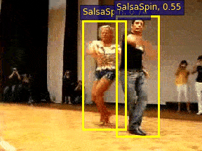
  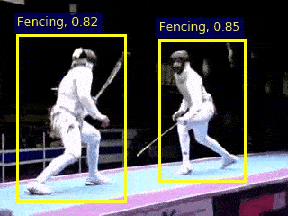
  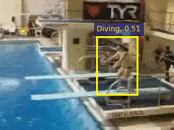
</div>
<div align="center" style="width:image width px;">
  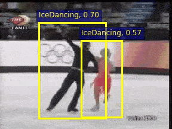
  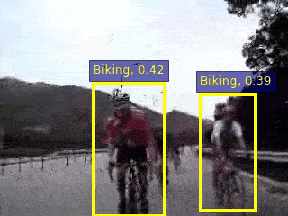
  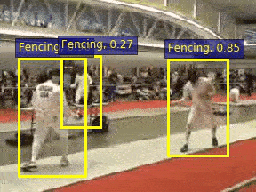
</div>

*(Note that the relative low scores are due to the property of the focal loss.)*


# Abstract    

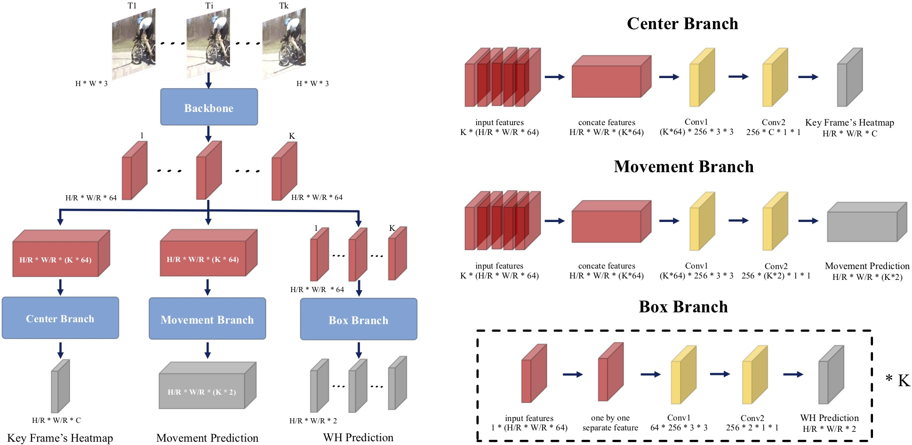

<br/>

&emsp;The existing action tubelet detectors mainly depend on heuristic anchor box design and placement, which might be computationally expensive and sub-optimal for precise localization of action instances. In this paper, we present a new action tubelet detection framework, termed as **MovingCenter Detector (MOC-detector)**, by treating an action instance as a trajectory of moving points. 

​    &emsp;Based on the analysis that movement information could simplify and assist the action tubelet detection, our MOC-detector is decomposed into three crucial head branches:

- (1) Center Branch for instance center detection and action recognition.

- (2) Movement Branch for movement estimation at adjacent frames to form moving point trajectories.

- (3) Box Branch for spatial extent detection by directly regressing bounding box size at the estimated center point of each frame. 

​    &emsp;These three branches work together to generate the tubelet detection results, that could be further linked to yield video level tubes with a common matching strategy. Our MOC-detector outperforms the existing state-of-the-art methods by a large margin under the same setting for frame-mAP and video-mAP on the JHMDB and UCF101-24 datasets. The performance gap is more evident for higher video IoU, demonstrating that our MOC-detector is particularly useful for more precise action detection.

<br/>

# Motivation

> Each action instance could be viewed as a trajectory of moving points. 

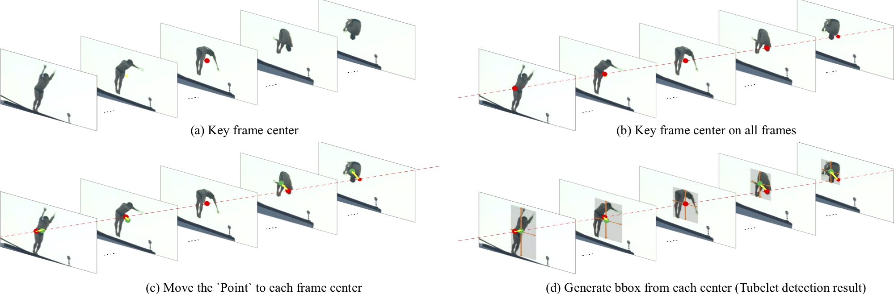

​	In this view, action tubelet detector could be decomposed into three simple steps: 

- (1) localizing the center point (red dot) at key frame (i.e., center frame).
- (2) estimating the movement at each frame with respect to center point (yellow arrow).
- (3) regressing bounding box size at the calculated center point (green dots) for all frames. 

<br/>


# Result

### Result on UCF101-24 &ensp;	&emsp;&emsp;(DLA-34,  K = 7)

| Input Stream | frameAP 0.5 | videoAP 0.2 | videoAP 0.5 | videoAP 0.75 | videoAP 0.5:0.95 |
| :----------: | :---------: | :---------: | :---------: | :----------: | :--------------: |
|     RGB      |    71.94    |    76.88    |    49.23    |    27.03     |      25.75       |
|     FLOW     |    67.10    |    74.99    |    44.86    |    17.90     |      20.68       |
| **RGB+FLOW** |  **77.79**  |  **81.83**  |  **53.86**  |  **28.53**   |    **27.69**     |

<br/>

### Result on JHMDB		&emsp;&emsp;&emsp;  &emsp; (DLA-34,  K = 7) 

|    JHMDB     | frameAP 0.5 | videoAP 0.2 | videoAP 0.5 | videoAP 0.75 | videoAP 0.5:0.95 |
| :----------: | :---------: | :---------: | :---------: | :----------: | :--------------: |
|     RGB      |    60.52    |    63.81    |    63.36    |    59.05     |      47.96       |
|     FLOW     |    67.09    |    77.44    |    77.11    |    60.65     |      51.67       |
| **RGB+FLOW** |  **74.02**  |  **80.67**  |  **80.52**  |  **75.03**   |    **60.23**     |

<br/>

### Ablation Study ：&emsp;Backbone&emsp;&emsp;&emsp;	(RGB only,  K = 5)

| Backbone  | frameAP 0.5 | videoAP 0.2 | videoAP 0.5 | videoAP 0.75 | videoAP 0.5:0.95 | Speed (relative) |
| :-------: | :---------: | :---------: | :---------: | :----------: | :--------------: | :--------------: |
| Resnet18  |    69.23    |    76.12    |    49.19    |    24.08     |      24.65       |      x 1.55      |
|  DLA-34   |    70.39    |    76.70    |    48.56    |    25.52     |      25.34       |      x 1.00      |
| Resnet101 |    70.60    |    77.45    |    50.57    |    26.24     |      25.89       |      x 0.92      |

<br/>

### Ablation study ：     &emsp;   K&emsp;&emsp;&emsp;&emsp;&emsp;&emsp;&emsp;(RGB only,  DLA-34)

|   K   | frameAP 0.5 | videoAP 0.2 | videoAP 0.5 | videoAP 0.75 | videoAP 0.5:0.95 | Speed (relative) |
| :---: | :---------: | :---------: | :---------: | :----------: | :--------------: | :--------------: |
| K = 1 |    66.78    |    63.52    |    29.74    |    13.49     |      14.41       |      x 1.45      |
| K = 3 |    69.89    |    73.49    |    44.94    |    22.92     |      22.94       |      x 1.13      |
| K = 5 |    70.39    |    76.70    |    48.56    |    25.52     |      25.34       |      x 1.00      |
| K = 7 |    71.94    |    76.88    |    49.23    |    27.03     |      25.75       |      x 0.85      |
| K = 9 |    72.15    |    77.34    |    48.88    |    25.95     |      25.76       |      x 0.75      |

<br/>

# Illustration of Three Movement  Strategies

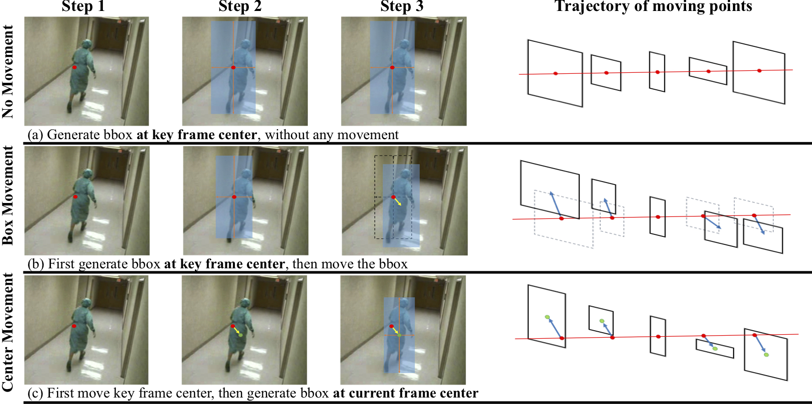

> *Left*: pipeline for detecting the bounding box at a non-key frame (i.e., normal frame).
>
> *Right*: illustration of detecting the tubelet.
>
> The arrow represents moving according to Movement Branch prediction, the red dot represents the key frame center and the green dot represents current frame center, which is localized by moving key frame center with Movement Branch prediction.

<br/>

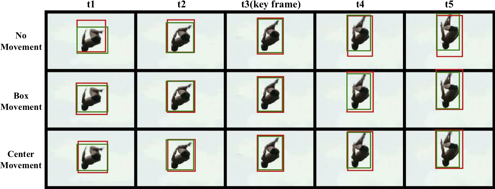

>Green box represents ground truth.
>
>Red box represents predicted box. 
>
>Note that the third frame is the key frame for tubelet length K=5.

<br/>

# Visualization


> Examples of Per-frame (K=1) and Tubelet (K=7) Detection.

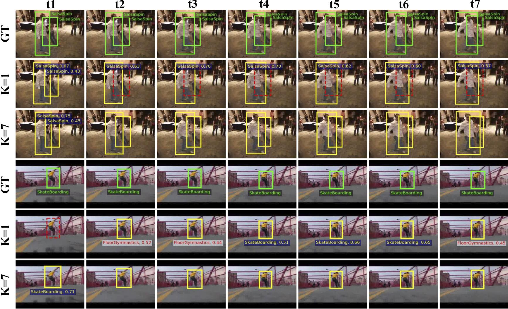

> Yellow color boxes present detection results.
>
>Yellow categories represent classifying correctly and red ones represent wrong. 
>
>Red dashed boxes represent missed actors.
>
> Green boxes and categories are the groundtruth.
>
>As our MOC-detector generates only one score and category for one tubelet, the score and category are only presented in the first frame for tubelet (K=7) detection.

<br/>


## Code will release soon......

<br/>

<br/>

<br/>

<br/>

<br/>

<br/>


### Citation
If you find this code is useful in your research, please cite:

```bibtex
@InProceedings{li2020actions,
    title={Actions as Moving Points},
    author={Yixuan Li and Zixu Wang and Limin Wang and Gangshan Wu},
    booktitle={arXiv preprint arXiv:2001.04608},
    year={2020}
}
```
